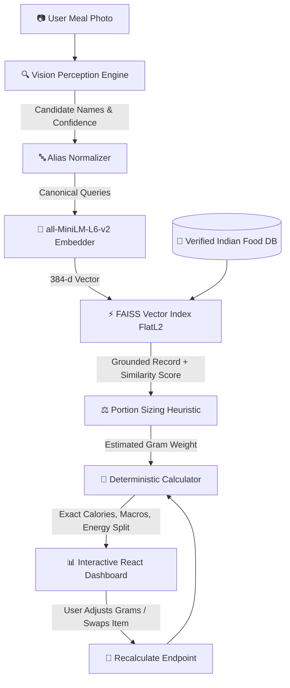

# 🍛 DietAI24 — Indian Food Calorie & Nutrition Estimator

[](https://fastapi.tiangolo.com)
[](https://react.dev)
[](https://vitejs.dev)
[](https://github.com/facebookresearch/faiss)
[](https://pytest.org)
[](https://opensource.org/licenses/MIT)

> **Academic Research & Engineering Implementation (Milestone 1)**  
> Grounding Vision-Language Models with Semantic Vector Search (FAISS RAG) to eliminate nutritional hallucinations in Indian meal dietary monitoring.

---

## 🌟 Why DietAI24?

Standard Large Multimodal Models (VLMs) suffer from **severe arithmetic hallucinations**: asking an LLM to guess calories directly leads to numbers that drift wildly (±40–60%) and violate basic thermodynamic macronutrient relations ($4\text{ kcal/g protein}, 4\text{ kcal/g carbs}, 9\text{ kcal/g fat}$).

DietAI24 solves this by enforcing strict **separation of concerns**:

1. **AI handles Perception** — Identifies what food items appear on the plate (e.g., *"roti", "yellow dal"*).
2. **Standardization & RAG handles Grounding** — Maps colloquial names to standardized food entries using FAISS dense vector search over verified Indian Food Composition tables.
3. **Deterministic Math handles Nutrition** — Calculates exact calories and macronutrients in Python using standard Atwater factors. **The AI never invents calorie numbers.**

---

## 🏗️ Architecture



---

## ✨ Features

- **🎯 Multi-Food Spatial Detection & Interactive Overlays:**
  - Detects and segments multiple concurrent food instances on a single meal plate (e.g. Rice, Dal, Paneer, Roti, Salad, Curd).
  - Renders interactive SVG bounding box overlays directly over the meal image preview.
  - Instance counting engine tracks multiple units (e.g. `2 rotis`, `3 idlis`, `1 omelette`).
- **🛡️ Strict Anti-False-Positive Engine & Safe Refusal:**
  - Eliminates the nearest-vector trap: **an Omelette never resolves to Yellow Dal Tadka**.
  - Enforces category incompatibility gating (Eggs cannot match Lentils; Breads cannot match Beverages).
  - Safe Refusal: Returns explicit `LOW_CONFIDENCE` or `NUTRITION_UNAVAILABLE` rather than guessing wrong foods.
- **🌐 Expanded Multi-Source Knowledge Base:**
  - Verified nutrition data combining **IFCT 2017** (Indian Food Composition Tables) and **USDA FoodData Central**.
  - Ingestion pipeline (`scripts/import_nutrition_data.py`) validates physical Atwater consistency ($4P + 4C + 9F \approx \text{kcal}$) and retains full source metadata (`source_name`, `source_id`, `data_quality`).
  - Indexed across 142 foods and 511 colloquial aliases.
- **🔍 Visual Debug Mode:**
  - Interactive multi-stage pipeline diagnostic trace displaying candidate region proposals, classification confidences, top vector matches, and rejected false-positive candidates.
- **🧪 Empirical Evaluation Benchmark:**
  - Complete evaluation suite in `evaluation/` with 10 acceptance tests and zero-fabrication metrics runner (`evaluation/run_eval.py`).
- **⚖️ Human-in-the-Loop Portion Correction:**
  - Users can tweak portions with preset multipliers (`0.7x Small`, `1.0x Regular`, `1.5x Large`) or custom numeric inputs with instant deterministic recalculation.
- **📑 Research Methodology Report:** Complete academic report in [`docs/research_report.md`](docs/research_report.md) and [`docs/architecture.md`](docs/architecture.md).

---

## 🚀 Quick Start Guide

### 1. Clone & Enter Directory
```bash
git clone https://github.com/your-repo/indian-food-calorie-estimator.git
cd indian-food-calorie-estimator
```

### 2. Backend Setup
```bash
# Install Python dependencies
python -m pip install -r backend/requirements.txt

# Create your .env file
cp backend/.env.example backend/.env
# On Windows PowerShell:
Copy-Item backend/.env.example backend/.env

# Build the FAISS Vector Index (runs once)
python scripts/build_index.py

# Start the FastAPI Server
python -m uvicorn backend.app.main:app --reload --port 8000
```
- API Documentation: [http://localhost:8000/docs](http://localhost:8000/docs)
- Health Check: [http://localhost:8000/health](http://localhost:8000/health)

### 3. Frontend Setup
In a new terminal:
```bash
cd frontend
npm install
npm run dev
```
- Application UI: [http://localhost:5173](http://localhost:5173)

---

## 🧪 Running Tests

From the project root:
```bash
python -m pytest tests -v
```
All 64 tests validate mathematical correctness, vector retrieval accuracy, and API endpoints.

---

## 📚 Documentation & Research

- [Research Methodology & Technical Report](docs/research_report.md) — Comprehensive technical paper detailing the DietAI24 architecture, VLM perception, volumetric density equations, and IFCT grounding.
- [Architecture Specification](docs/architecture.md) — Detailed pipeline stages, data flow, and schemas.
- [Local Setup Guide](docs/setup.md) — Complete environment configuration, Gemini/Claude keys, and troubleshooting.
- [Methodology Overview](docs/methodology.md) — Mathematical formulation, Atwater consistency, and error analysis.

---

## ⚠️ Academic & Medical Disclaimer

DietAI24 is an experimental research and educational tool created for academic evaluation and computer vision demonstration. Preparation methods (specifically oil, ghee, and portion density) vary significantly across home and restaurant cooking. **All generated values are estimates and should not be used for medical, clinical, or diagnostic dietary planning.**
